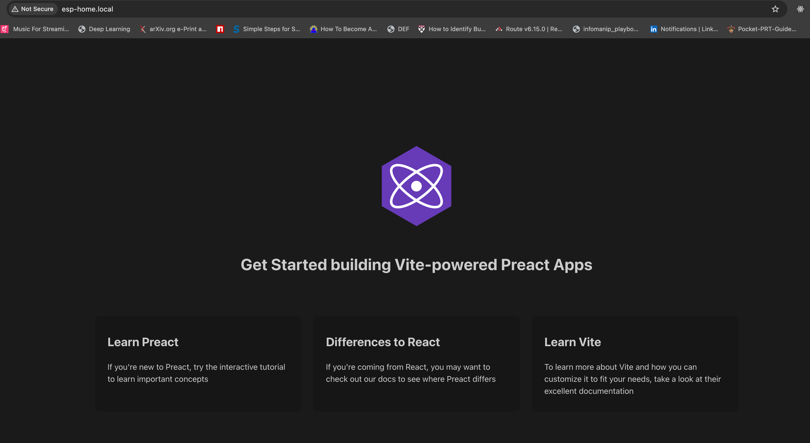

# Serving a React App from an ESP32

## Motivation

I wanted to play around with a recent ESP32 purchase and blur the lines with my day job (web dev).

TL;DR - Taking the restful_server example provided by espressif and swapping FE to be React + removing unused endpoints. I chose Preact because its smaller.

Could be a jump off point for making a simple UI for future IO projects.

## Instructions

- Install esp-idf vscode extension
- SDK Config settings: Deploy website to SPI Nor Flash, add wifi SSID and password
- Plug in ESP32 via USB to USB-C, flash via UART
- Build Frontend: cd frontend && npm run build
- Build project (ESP-IDF: Build you project)
- Flash project (ESP-IDF: Flash you project)
- Go to http://esp-home.local/

## Learnings

- I used the esp-idf VS Code extension, which worked out of the box
- If you see something like `command not found: idf.py`, use the esp-idf extension to open an ESP-IDF terminal (under COMMANDS tab on left side)
- Files from `/dist` are copied to the [SPIFFS (SPI Flash File System) file system](https://docs.espressif.com/projects/esp-idf/en/stable/esp32/api-reference/storage/spiffs.html#spiffs-filesystem) embedded on the board. More on [configuring SPIFFS](https://docs.espressif.com/projects/esp-idf/en/stable/esp32/api-reference/storage/spiffs.html#functions).
- SPI NOR: [Serial Periphial Interface](https://en.wikipedia.org/wiki/Serial_Peripheral_Interface) (SPI) + [Not-or](https://www.techtarget.com/searchstorage/definition/NOR-flash-memory) logic gates use(NOR)
